# PLA
---
## Filament
-   [ANYCUBIC PLA](https://www.amazon.co.jp/ANYCUBIC-3D%E3%83%97%E3%83%AA%E3%83%B3%E3%82%BF%E3%83%BC%E7%94%A8-%E3%83%95%E3%82%A3%E3%83%A9%E3%83%A1%E3%83%B3%E3%83%88-%E7%92%B0%E5%A2%83%E4%BF%9D%E8%AD%B7-%E3%80%901-75mm%E3%80%91%E3%80%90%E6%AD%A3%E5%91%B31kg%E3%80%91/dp/B06XH9YJ8S/ref=redir_mobile_desktop?ie=UTF8&aaxitk=yH7ceeT1d1v09rB9u0hhaA&hsa_cr_id=2804751890003&pd_rd_r=1d3f48da-c2ed-46a6-bbd0-b1e7adbcfd8e&pd_rd_w=z8ixr&pd_rd_wg=sh1JM&ref_=sbx_be_s_sparkle_mcd_asin_1_img)

    

---
## Basic Parameteres

|Name|Parameter|
|---|---|
|**Infill Density [%]** インフィル密度|20|
|**Infill Pattern** 初期レイヤー高さ|Gyroid|
|**Printing Temperature [℃]** 印刷温度|200|
|**Bulid Plate Temperature [℃]** ビルドプレート温度|60|
|**Print Speed [mm/s]** 印刷速度|60|
|**Initial Layer Speed [mm/s]** 初期レイヤー印刷速度|5|
|**Enable Retraction** 引き戻し有効|available|
|**Enable Print Cooling** 印刷中の冷却を有効にする|available|
|**Build Plate Adhesion Type** ビルドプレート接着タイプ|Skirt|

---
## Antenna

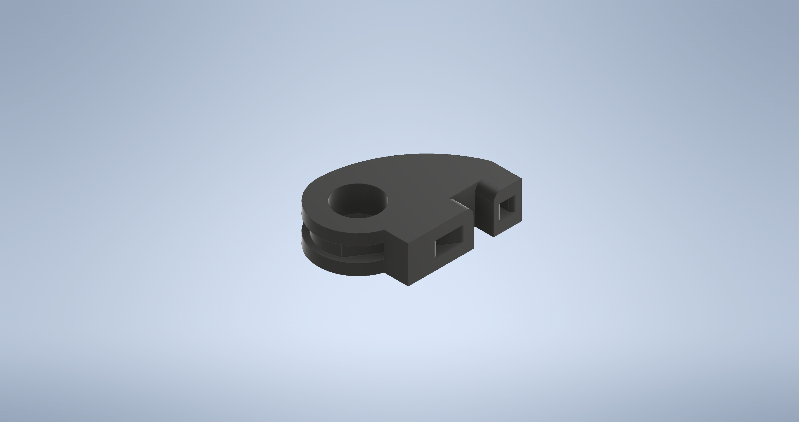
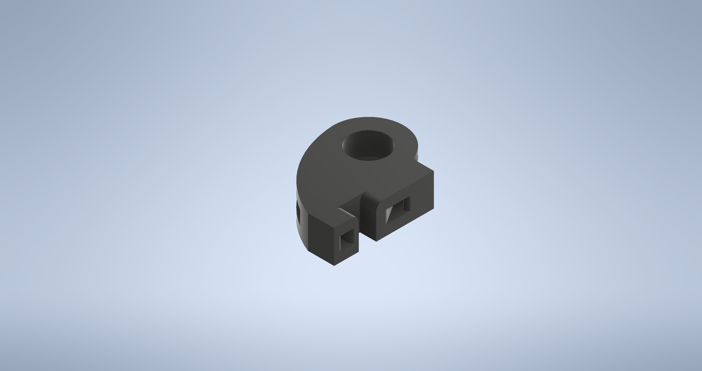

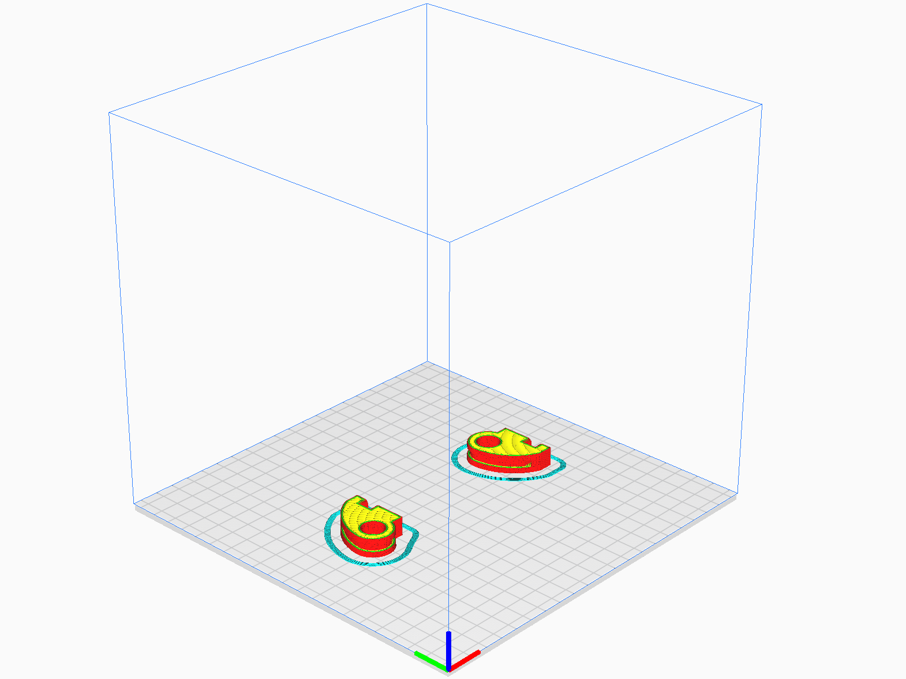

-   ### Files

    -   #### CAD  
        -   [Antenna.ipt](https://github.com/citbrains/OpenPlatform/blob/a4b5907f3c764cb437537e5cbbeef6c4c5cdda09/mechanism/OpenPlatform_ver3_0/%E4%B8%8A%E5%8D%8A%E8%BA%AB/%E3%82%B3%E3%83%83%E3%82%AF%E3%83%94%E3%83%83%E3%83%88/%E3%82%B3%E3%83%83%E3%82%AF%E3%83%94%E3%83%83%E3%83%88_2/Antenna.ipt)

            `OpenPlatform/mechanism/OpenPlatform_ver3_0/上半身/コックピット/コックピット_2/Antenna.ipt`
            
        -   [Antenna_MIR.ipt](https://github.com/citbrains/OpenPlatform/blob/a4b5907f3c764cb437537e5cbbeef6c4c5cdda09/mechanism/OpenPlatform_ver3_0/%E4%B8%8A%E5%8D%8A%E8%BA%AB/%E3%82%B3%E3%83%83%E3%82%AF%E3%83%94%E3%83%83%E3%83%88/%E3%82%B3%E3%83%83%E3%82%AF%E3%83%94%E3%83%83%E3%83%88_2/Antenna_MIR.ipt)

            `OpenPlatform/mechanism/OpenPlatform_ver3_0/上半身/コックピット/コックピット_2/Antenna_MIR.ipt`

    -   #### STL
        -   [Antenna.stl](Antenna.stl)
        -   [Antenna_MIR.stl](Antenna_MIR.stl)

    -   #### Gcode
        -   [Antennas.gcode](Antennas.gcode)

    -   #### Profile
        -   [Antenna.curaprofile](Antenna.curaprofile)

-   ### Characteristical parameteres
    |Parameter Name|Parameter|
    |---|---|
    |**Layer Hight [mm]** レイヤー高さ|0.2|
    |**Generate Support** サポート開始|N/A|

-   ### Quantity
    -   1 pc of each

-   ### Estimated print time
    -   1 h 11 m

-   ### Additional processing
    -   N/A

-   ### Works cited
    -   N/A

---
## New_Accelite_Controller_Cover

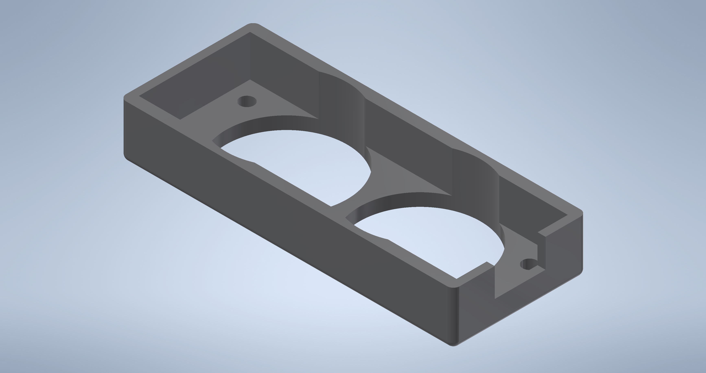
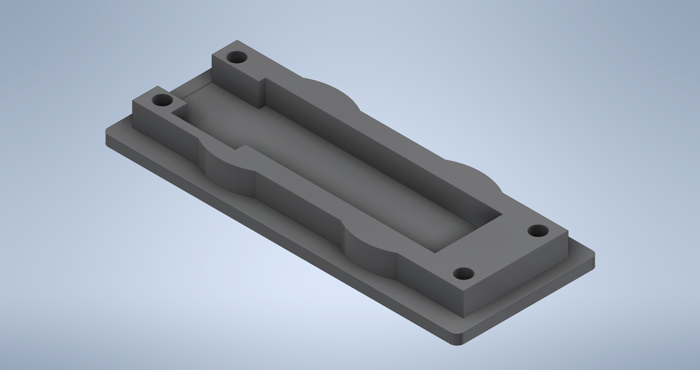

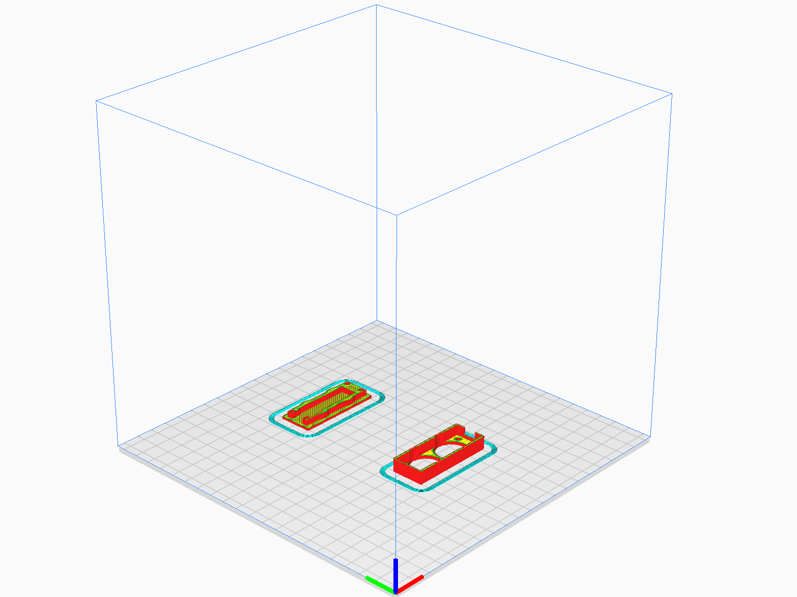

-   ### Files

    -   #### CAD  
        -   [New_Accelite_Controller_Cover_copy.ipt](https://github.com/citbrains/OpenPlatform/blob/a4b5907f3c764cb437537e5cbbeef6c4c5cdda09/mechanism/OpenPlatform_ver3_0/%E4%B8%8A%E5%8D%8A%E8%BA%AB/%E3%82%B3%E3%83%83%E3%82%AF%E3%83%94%E3%83%83%E3%83%88/%E3%82%B3%E3%83%83%E3%82%AF%E3%83%94%E3%83%83%E3%83%88_2/New_Accelite_Controller_Cover_copy.ipt)

            `OpenPlatform/mechanism/OpenPlatform_ver3_0/上半身/コックピット/コックピット_2/New_Accelite_Controller_Cover_copy.ipt`

        - [New_Accelite_Controller_Cover_copy_under.ipt](https://github.com/citbrains/OpenPlatform/blob/a4b5907f3c764cb437537e5cbbeef6c4c5cdda09/mechanism/OpenPlatform_ver3_0/%E4%B8%8A%E5%8D%8A%E8%BA%AB/%E3%82%B3%E3%83%83%E3%82%AF%E3%83%94%E3%83%83%E3%83%88/%E3%82%B3%E3%83%83%E3%82%AF%E3%83%94%E3%83%83%E3%83%88_2/New_Accelite_Controller_Cover_copy_under.ipt)

            `OpenPlatform/mechanism/OpenPlatform_ver3_0/上半身/コックピット/コックピット_2/New_Accelite_Controller_Cover_copy_under.ipt`

    -   #### STL
        - [New_Accelite_Controller_Cover_copy.stl](New_Accelite_Controller_Cover/New_Accelite_Controller_Cover_copy.stl)

        - [New_Accelite_Controller_Cover_copy_under.stl](New_Accelite_Controller_Cover/New_Accelite_Controller_Cover_copy_under.stl)

    -   #### Gcode
        - [Controller_Cover.gcode](New_Accelite_Controller_Cover/Controller_Cover.gcode)

    -   #### Profile
        - [Controller_Cover.curaprofile](New_Accelite_Controller_Cover/Controller_Cover.curaprofile)

-   ### Characteristical parameteres
    |Parameter Name|Parameter|
    |---|---|
    |**Layer Hight [mm]** レイヤー高さ|0.2|
    |**Generate Support** サポート開始|N/A|

-   ### Quantity
    -   1 pc of each

-   ### Estimated print time
    -   48 m

-   ### Additional processing
    -   N/A

-   ### Works cited
    -   N/A
    
---
## SwitchCov

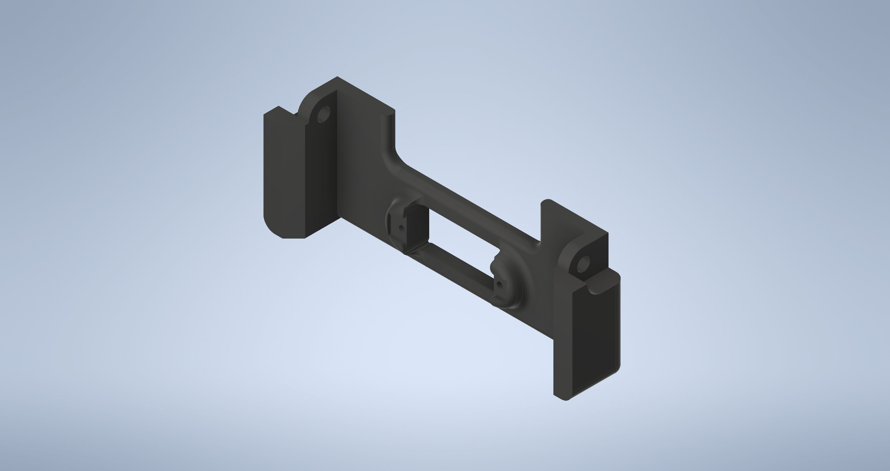

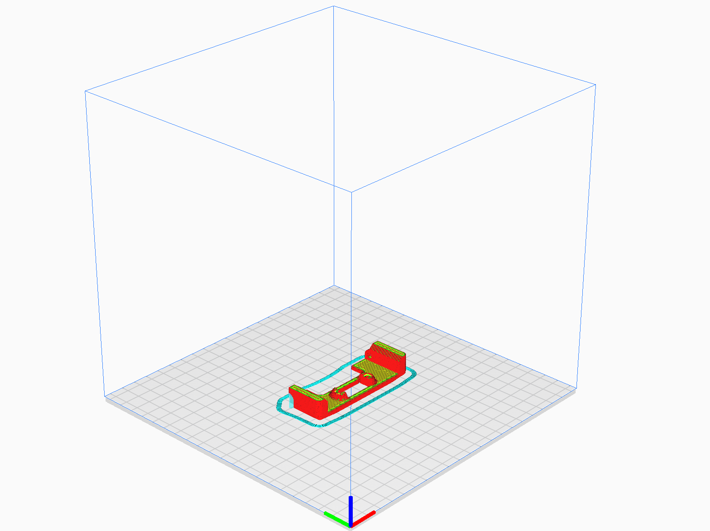

-   ### Files

    -   #### CAD
        
        Improvement version Branch : [Fix_SwitchCov](https://github.com/citbrains/OpenPlatform/tree/Fix_SwitchCov)

        STL version : commit [1c000b001d7586965ef5ba650b1c151932267094](https://github.com/citbrains/OpenPlatform/tree/1c000b001d7586965ef5ba650b1c151932267094)        

        - [SwitchCov.ipt]()

          `OpenPlatform/mechanism/OpenPlatform_ver3_0/上半身/コックピット/コックピット_2/SwitchCov.ipt`

    -   #### STL
        - [SwitchCov.stl](SwitchCov.stl)

    -   #### Gcode
        - [SwitchCov.gcode](SwitchCov.gcode)

    -   #### Profile
        - [SwitchCov.curaprofile](SwitchCov.curaprofile)

-   ### Characteristical parameteres
    |Parameter Name|Parameter|
    |---|---|
    |**Layer Hight [mm]** レイヤー高さ|0.2|
    |**Generate Support** サポート開始|available|

-   ### Quantity
    -   1 pc

-   ### Estimated print time
    -   1 h 3 m

-   ### Additional processing
    -   ネジ切り M2 * 2

-   ### Works cited
    -   N/A
    
---
## カメラ_外装

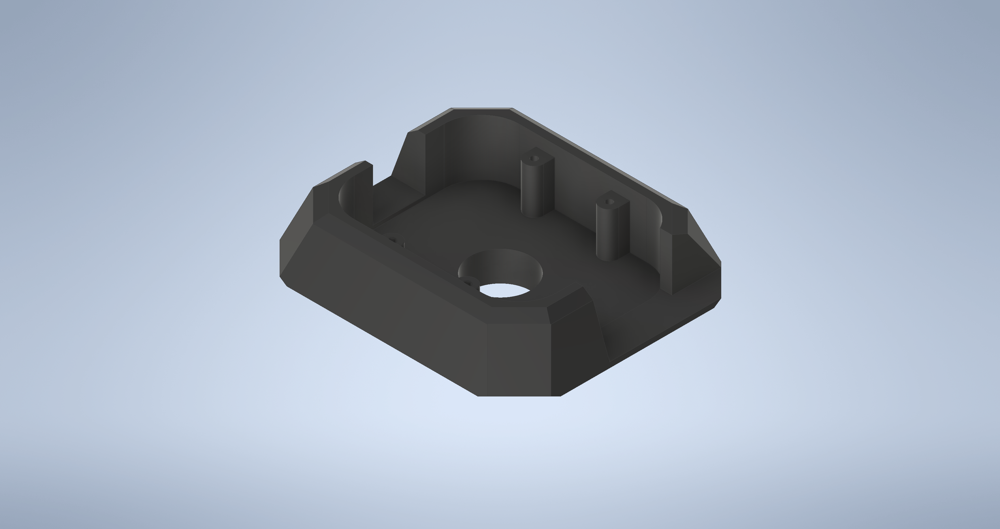

-   ### Files

    -   #### CAD

        - [カメラ_外装.ipt](https://github.com/citbrains/OpenPlatform/blob/a4b5907f3c764cb437537e5cbbeef6c4c5cdda09/mechanism/OpenPlatform_ver3_0/%E4%B8%8A%E5%8D%8A%E8%BA%AB/%E9%A0%AD/%E3%82%AB%E3%83%A1%E3%83%A9_%E5%A4%96%E8%A3%85.ipt)

          `OpenPlatform/mechanism/OpenPlatform_ver3_0/上半身/頭/カメラ_外装.ipt
`

    -   #### STL
        - [カメラ_外装.stl](カメラ_外装/カメラ_外装.stl)

    -   #### Gcode
        - [Camera.gcode](カメラ_外装/Camera.gcode)

    -   #### Profile
        - [Camera.curaprofile](カメラ_外装/Camera.curaprofile)

-   ### Characteristical parameteres
    |Parameter Name|Parameter|
    |---|---|
    |**Layer Hight [mm]** レイヤー高さ|0.2|
    |**Generate Support** サポート開始|available|

-   ### Quantity
    -   1 pc

-   ### Estimated print time
    -   2 h 52 m

-   ### Additional processing
    -   ネジ切り M2 * 4

-   ### Works cited
    -   N/A
    
---
## コックピット

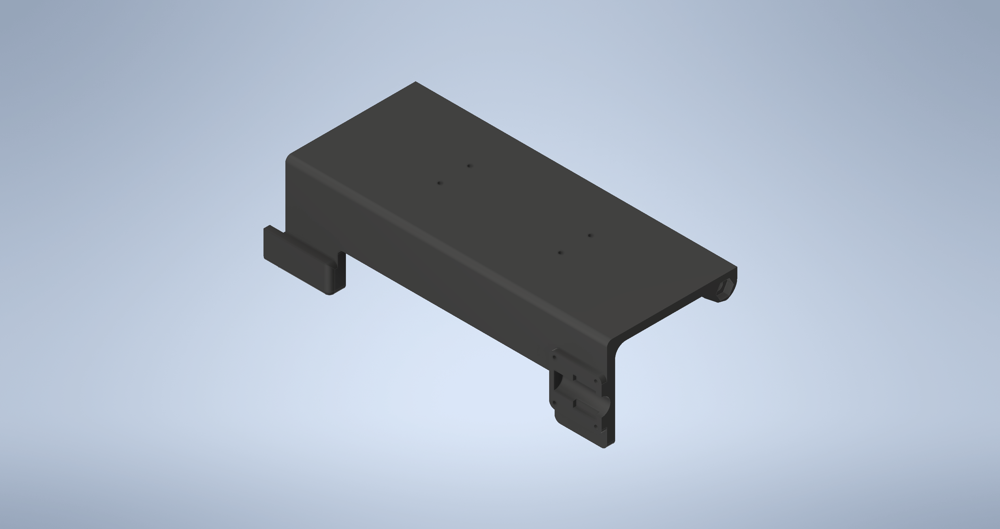
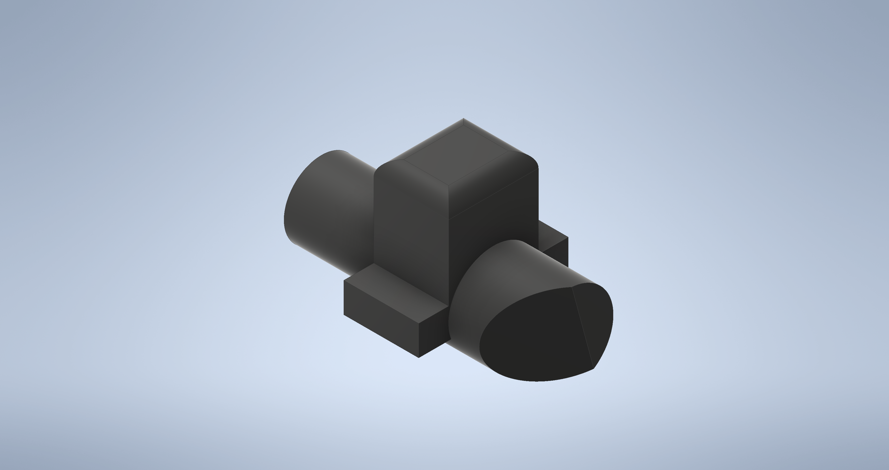
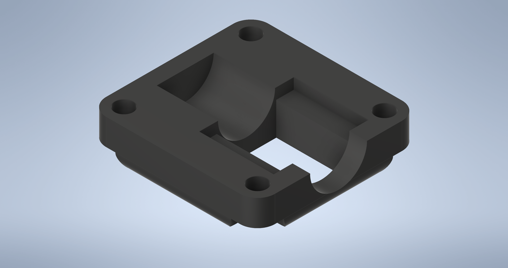

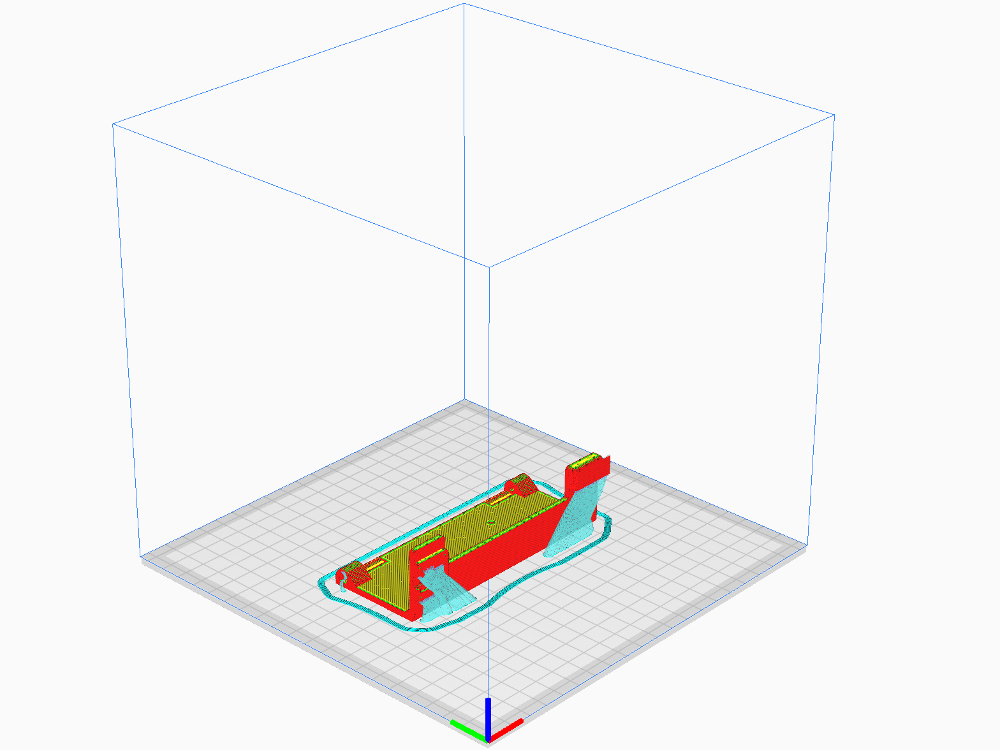
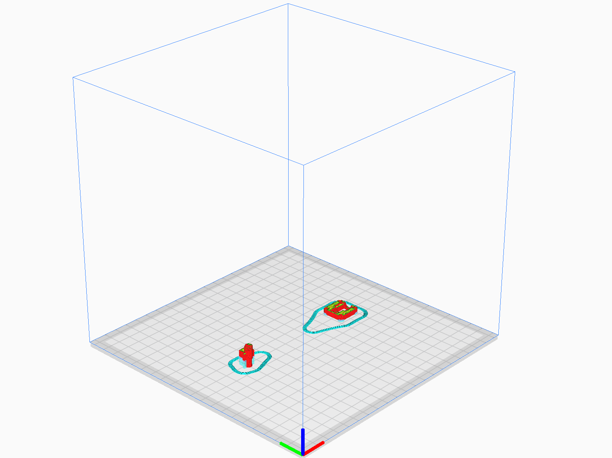

-   ### Files

    -   #### CAD

        Improvement version Branch : [New_BatteryBox](https://github.com/citbrains/OpenPlatform/tree/New_BatteryBox)

        STL version : commit [43e9e1346e4216fdac78b60479cbb7ee6bb19e6d](https://github.com/citbrains/OpenPlatform/commit/43e9e1346e4216fdac78b60479cbb7ee6bb19e6d)
        
        - [コックピット_サブフレーム_1_7.ipt](https://github.com/citbrains/OpenPlatform/blob/43e9e1346e4216fdac78b60479cbb7ee6bb19e6d/mechanism/OpenPlatform_ver3_0/%E4%B8%8A%E5%8D%8A%E8%BA%AB/%E3%82%B3%E3%83%83%E3%82%AF%E3%83%94%E3%83%83%E3%83%88/%E3%82%B3%E3%83%83%E3%82%AF%E3%83%94%E3%83%83%E3%83%88_2/%E3%82%B3%E3%83%83%E3%82%AF%E3%83%94%E3%83%83%E3%83%88_%E3%82%B5%E3%83%96%E3%83%95%E3%83%AC%E3%83%BC%E3%83%A0_1_7.ipt)

          `OpenPlatform/mechanism/OpenPlatform_ver3_0/上半身/コックピット/コックピット_2/コックピット_サブフレーム_1_7.ipt`

        - [コックピット_スライドロック.ipt](https://github.com/citbrains/OpenPlatform/blob/43e9e1346e4216fdac78b60479cbb7ee6bb19e6d/mechanism/OpenPlatform_ver3_0/%E4%B8%8A%E5%8D%8A%E8%BA%AB/%E3%82%B3%E3%83%83%E3%82%AF%E3%83%94%E3%83%83%E3%83%88/%E3%82%B3%E3%83%83%E3%82%AF%E3%83%94%E3%83%83%E3%83%88_2/%E3%82%B3%E3%83%83%E3%82%AF%E3%83%94%E3%83%83%E3%83%88_%E3%82%B9%E3%83%A9%E3%82%A4%E3%83%89%E3%83%AD%E3%83%83%E3%82%AF.ipt)

          `OpenPlatform/mechanism/OpenPlatform_ver3_0/上半身/コックピット/コックピット_2/コックピット_スライドロック.ipt`

        - [コックピット_スライドロックカバー.ipt](https://github.com/citbrains/OpenPlatform/blob/43e9e1346e4216fdac78b60479cbb7ee6bb19e6d/mechanism/OpenPlatform_ver3_0/%E4%B8%8A%E5%8D%8A%E8%BA%AB/%E3%82%B3%E3%83%83%E3%82%AF%E3%83%94%E3%83%83%E3%83%88/%E3%82%B3%E3%83%83%E3%82%AF%E3%83%94%E3%83%83%E3%83%88_2/%E3%82%B3%E3%83%83%E3%82%AF%E3%83%94%E3%83%83%E3%83%88_%E3%82%B9%E3%83%A9%E3%82%A4%E3%83%89%E3%83%AD%E3%83%83%E3%82%AF%E3%82%AB%E3%83%90%E3%83%BC.ipt)

          `OpenPlatform/mechanism/OpenPlatform_ver3_0/上半身/コックピット/コックピット_2/コックピット_スライドロックカバー.ipt`

    -   #### STL
        - [コックピット_サブフレーム_1_7.stl](コックピット/コックピット_サブフレーム_1_7.stl)

        - [コックピット_スライドロック.stl](コックピット/コックピット_スライドロック.stl)

        - [コックピット_スライドロックカバー.stl](コックピット/コックピット_スライドロックカバー.stl)

    -   #### Gcode
        - [Frame.gcode](コックピット/Frame.gcode)

        - [Slide_Cover.gcode](コックピット/Slide_Cover.gcode)

    -   #### Profile

        - [Frame.curaprofile](コックピット/Frame.curaprofile)

        - [Slide_Cover.curaprofile](コックピット/Slide_Cover.curaprofile)

-   ### Characteristical parameteres
    |Parameter Name|Parameter|
    |---|---|
    |**Layer Hight [mm]** レイヤー高さ|0.2|
    |**Generate Support** サポート開始|available|

    - Support Structure (サポート構造)
      - コックピット_サブフレーム_1_7 : Tree
      - コックピット_スライドロック & コックピット_スライドロックカバー : Normal

-   ### Quantity
    -   1 pc of each

-   ### Estimated print time
    -   コックピット_サブフレーム_1_7
        -   3 h 33 m

    -   コックピット_スライドロック & コックピット_スライドロックカバー
        -   34 m

-   ### Additional processing
    -   コックピット_サブフレーム_1_7
        -   ネジ切り M2 * 4

-   ### Works cited
    -   N/A
    
---
## 腕先

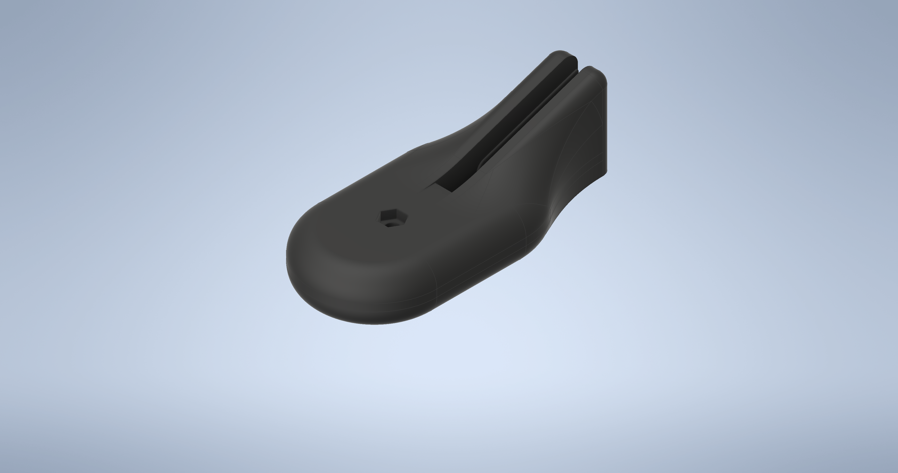

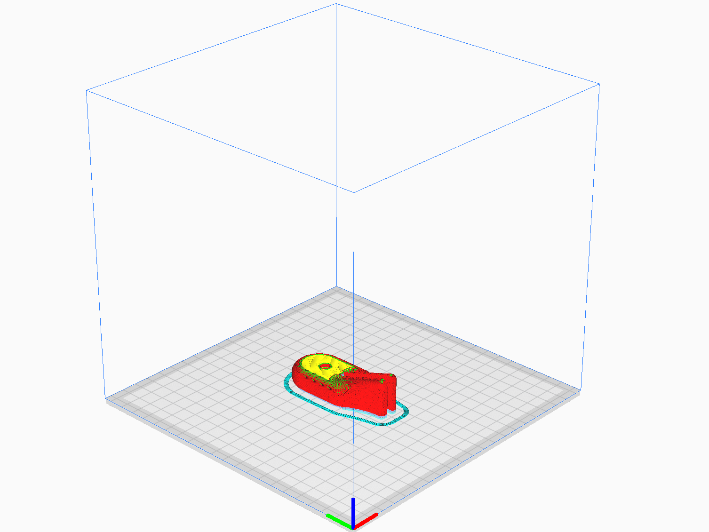

-   ### Files

    -   #### CAD  
        - [腕先.ipt](https://github.com/citbrains/OpenPlatform/blob/a4b5907f3c764cb437537e5cbbeef6c4c5cdda09/mechanism/OpenPlatform_ver3_0/%E4%B8%8A%E5%8D%8A%E8%BA%AB/%E8%85%95/%E8%85%95%E5%85%88.ipt)

          `OpenPlatform/mechanism/OpenPlatform_ver3_0/上半身/腕/腕先.ipt`

    -   #### STL
        - [腕先.stl](腕先/腕先.stl)

    -   #### Gcode
        - [Hand.gcode](腕先/Hand.gcode)

    -   #### Profile
        - [Hand.curaprofile](腕先/Hand.curaprofile)

-   ### Characteristical parameteres
    |Parameter Name|Parameter|
    |---|---|
    |**Layer Hight [mm]** レイヤー高さ|0.2|
    |**Generate Support** サポート開始|available|

-   ### Quantity
    -   2 pcs

-   ### Estimated print time
    -   1 h 36 m / 1 pc

-   ### Additional processing
    -   N/A

-   ### Works cited
    -   N/A
