# TPU
---
## Filament
-   [Pxmalion Flexible TPU](https://www.amazon.co.jp/dp/B074W3Y44S)

    

---
## Basic Parameteres

|Name|Parameter|
|---|---|
|**Printing Temperature [℃]** 印刷温度|190|
|**Bulid Plate Temperature [℃]** ビルドプレート温度|0 ~ 60|
|**Print Speed [mm/s]** 印刷速度|30|
|**Initial Layer Speed [mm/s]** 初期レイヤー印刷速度|15|
|**Enable Retraction** 引き戻し有効|N/A|
|**Enable Print Cooling** 印刷中の冷却を有効にする|available|
|**Generate Support** サポート開始|N/A|

---
## CameraCable_Assist

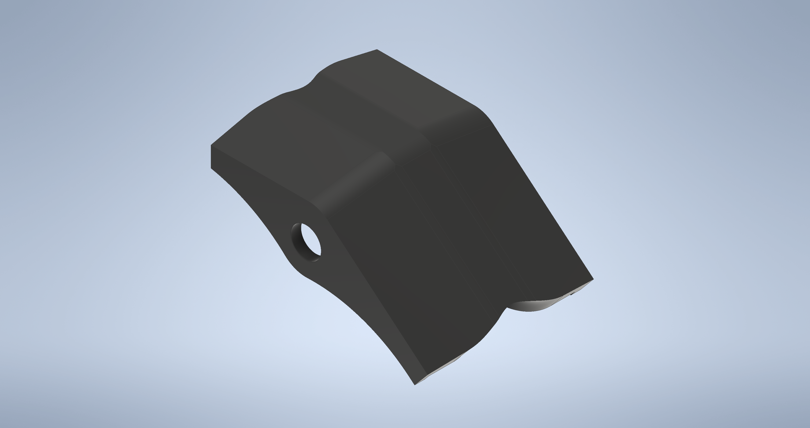

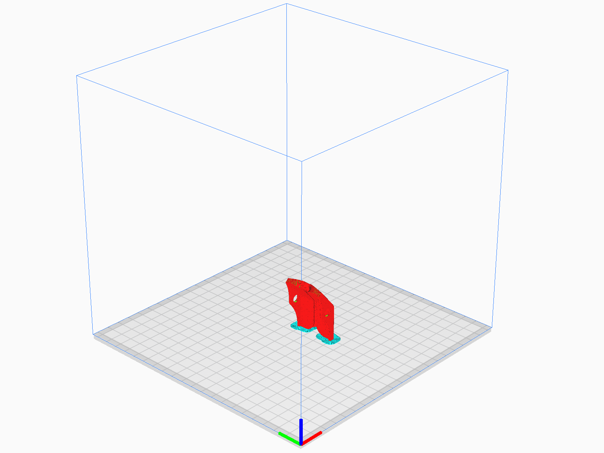

-   ### Files

    -   #### CAD  
        -   [CameraCable_Assist.ipt](https://github.com/citbrains/OpenPlatform/tree/a4b5907f3c764cb437537e5cbbeef6c4c5cdda09/mechanism/OpenPlatform_ver3_0/%E4%B8%8A%E5%8D%8A%E8%BA%AB/%E9%A0%AD/CameraCable_Assist.ipt)

            `OpenPlatform/mechanism/OpenPlatform_ver3_0/上半身/頭/CameraCable_Assist.ipt`

    -   #### STL
        -   [CameraCable_Assist.stl](CameraCable_Assist/CameraCable_Assist.stl)

    -   #### Gcode
        -   [Cable_Assist.gcode](CameraCable_Assist/Cable_Assist.gcode)

    -   #### Profile
        -   [Cable_Assist.curaprofile](CameraCable_Assist/Cable_Assist.curaprofile)

-   ### Characteristical parameteres
    |Parameter Name|Parameter|
    |---|---|
    |**Infill Density [%]** インフィル密度|100|
    |**LayerHight [mm]** レイヤー高さ|0.2|
    |**Bulid Plate Temperature [℃]** ビルドプレート温度|0|
    |**Build Plate Adhesion Type** ビルドプレート接着タイプ|Brim|
    

-   ### Quantity
    -   1 pc

-   ### Estimated print time
    -   1 h 36 m

-   ### Additional processing
    -   N/A

-   ### Works cited
    -   N/A

---
## FreundBumper_Stand

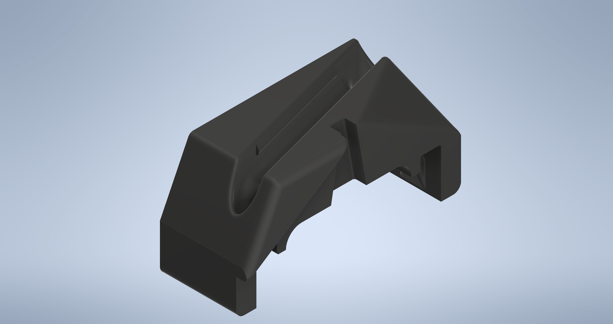
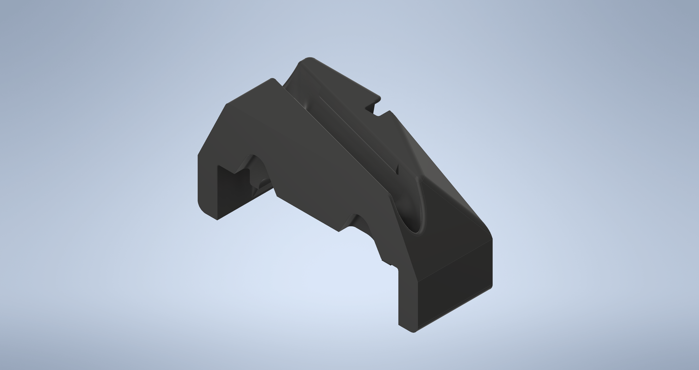

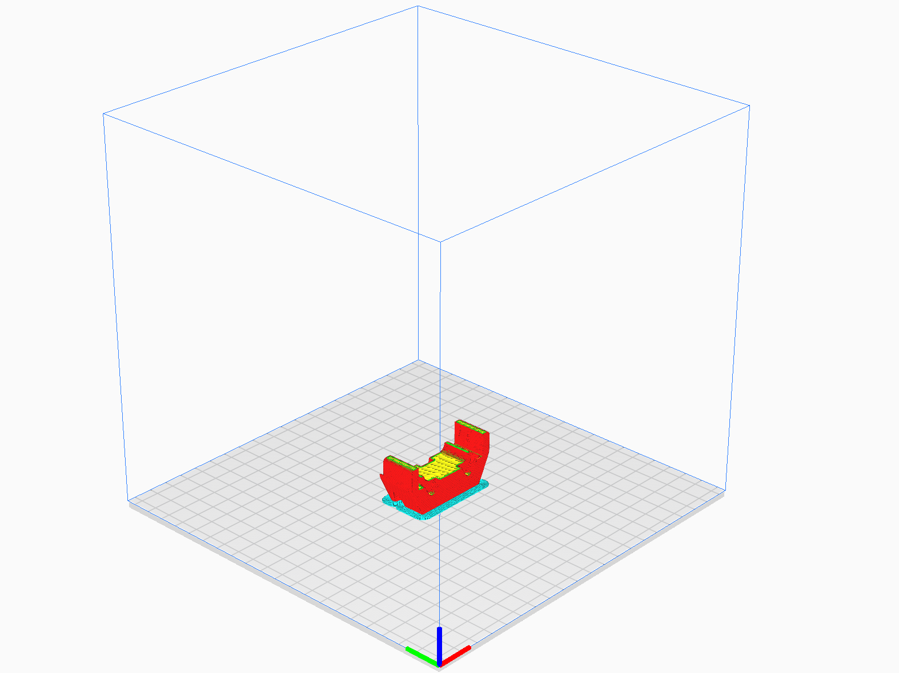
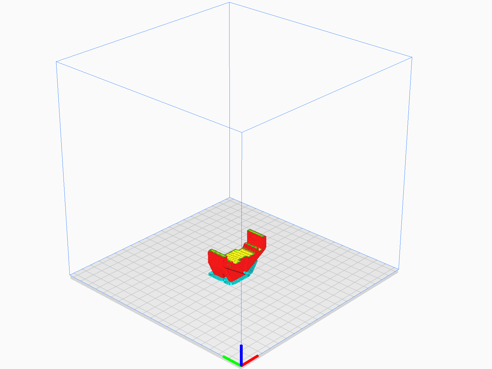

-   ### Files

    -   #### CAD  
        -   [FreundBumper_Stand.ipt](https://github.com/citbrains/OpenPlatform/tree/a4b5907f3c764cb437537e5cbbeef6c4c5cdda09/mechanism/OpenPlatform_ver3_0/%E4%B8%8A%E5%8D%8A%E8%BA%AB/%E8%83%B4%E4%BD%93/FreundBumper_Stand.ipt)

            `OpenPlatform/mechanism/OpenPlatform_ver3_0/上半身/胴体/FreundBumper_Stand.ipt`

        -   [FreundBumper_Stand_MIR.ipt](https://github.com/citbrains/OpenPlatform/tree/a4b5907f3c764cb437537e5cbbeef6c4c5cdda09/mechanism/OpenPlatform_ver3_0/%E4%B8%8A%E5%8D%8A%E8%BA%AB/%E8%83%B4%E4%BD%93/FreundBumper_Stand_MIR.ipt)

            `OpenPlatform/mechanism/OpenPlatform_ver3_0/上半身/胴体/FreundBumper_Stand_MIR.ipt`

    -   #### STL
        -   [FreundBumper_Stand.stl](FreundBumper_Stand/FreundBumper_Stand.stl)
        -   [FreundBumper_Stand_MIR.stl](FreundBumper_Stand/FreundBumper_Stand_MIR.stl)

    -   #### Gcode
        -   [Bumper_Stand.gcode](FreundBumper_Stand/Bumper_Stand.gcode)
        -   [Bumper_Stand_MIR.gcode](FreundBumper_Stand/Bumper_Stand_MIR.gcode)

    -   #### Profile
        -   [Bumper_Stand.curaprofile](FreundBumper_Stand/Bumper_Stand.curaprofile)

-   ### Characteristical parameteres
    |Parameter Name|Parameter|
    |---|---|
    |**Infill Density [%]** インフィル密度|100|
    |**LayerHight [mm]** レイヤー高さ|0.2|
    |**Bulid Plate Temperature [℃]** ビルドプレート温度|60|
    |**Build Plate Adhesion Type** ビルドプレート接着タイプ|Brim|

-   ### Quantity
    -   1 pc of each

-   ### Estimated print time
    -   3 h 22 m of each

-   ### Additional processing
    -   N/A

-   ### Works cited
    -   [issue](https://github.com/citbrains/citbrains_humanoid/issues/999#issuecomment-499572870)

---
## FrontBumper_main

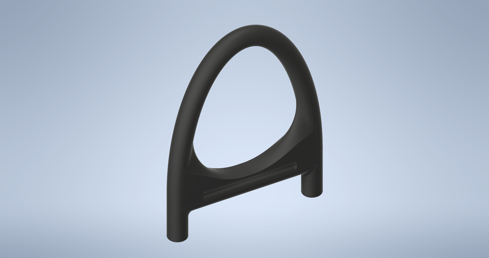

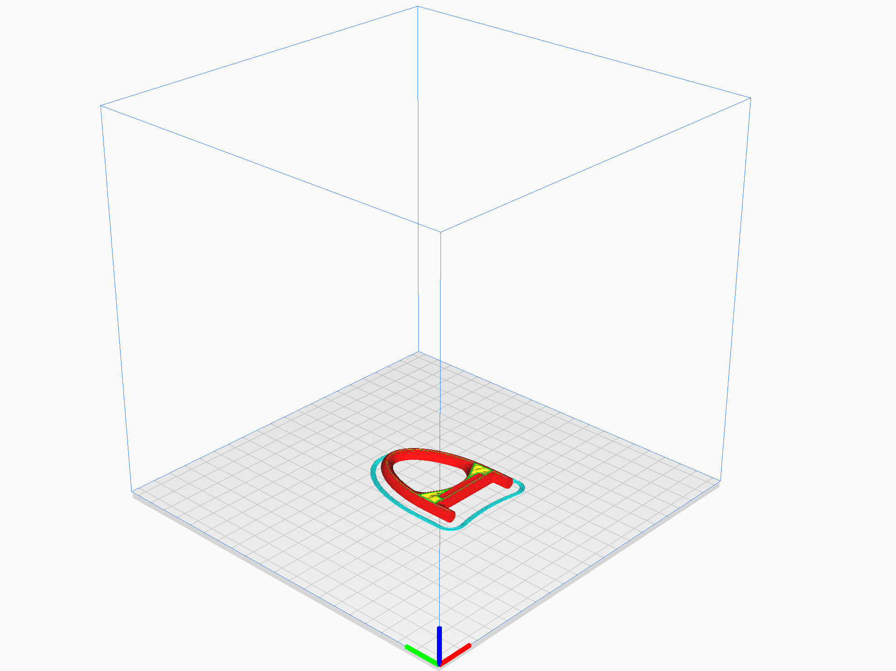

-   ### Files

    -   #### CAD  
        -   [FrontBumper_main.ipt](https://github.com/citbrains/OpenPlatform/blob/a4b5907f3c764cb437537e5cbbeef6c4c5cdda09/mechanism/OpenPlatform_ver3_0/%E4%B8%8A%E5%8D%8A%E8%BA%AB/%E8%83%B4%E4%BD%93/FrontBumper_main.ipt)

            `OpenPlatform/mechanism/OpenPlatform_ver3_0/上半身/胴体/FrontBumper_main.ipt`

    -   #### STL
        -   [FrontBumpe_mainr.stl](FrontBumpe_mainr/FrontBumpe_mainr.stl)

    -   #### Gcode
        -   [FrontBumper_main.gcode](FrontBumpe_mainr/FrontBumper_main.gcode)

    -   #### Profile
        -   [FrontBumper.curaprofeil](FrontBumpe_mainr/FrontBumper.curaprofeil)

-   ### Characteristical parameteres
    |Parameter Name|Parameter|
    |---|---|
    |**Infill Density [%]** インフィル密度|100|
    |**LayerHight [mm]** レイヤー高さ|0.1|
    |**Bulid Plate Temperature [℃]** ビルドプレート温度|60|
    |**Build Plate Adhesion Type** ビルドプレート接着タイプ|Skirt|

-   ### Quantity
    -   2 pcs

-   ### Estimated print time
    -   2 h 46 m / 1 pc

-   ### Additional processing
    -   N/A

-   ### Works cited
    -   [issue](https://github.com/citbrains/citbrains_humanoid/issues/999#issuecomment-499572870)

---
## RearBumper_Lower

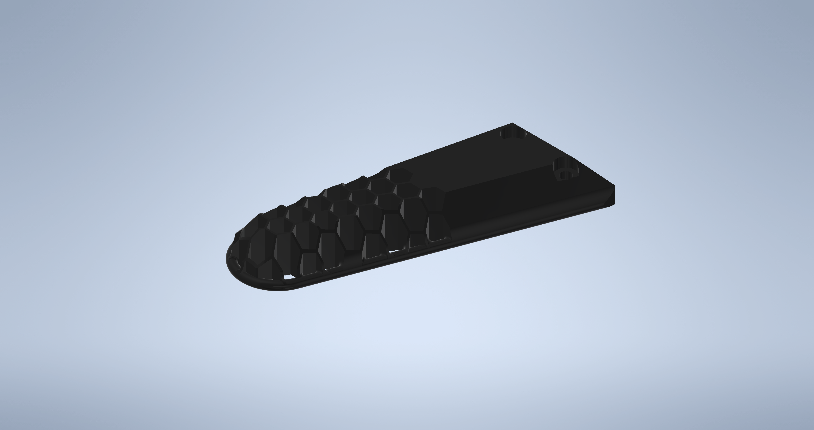
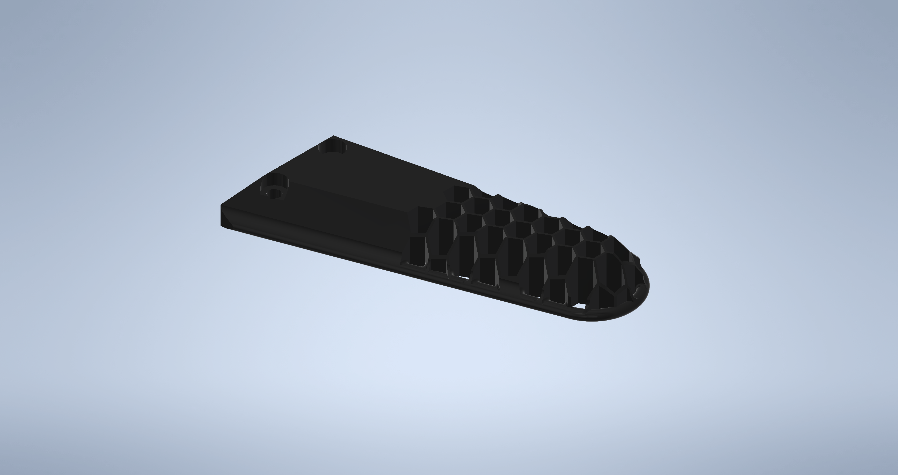

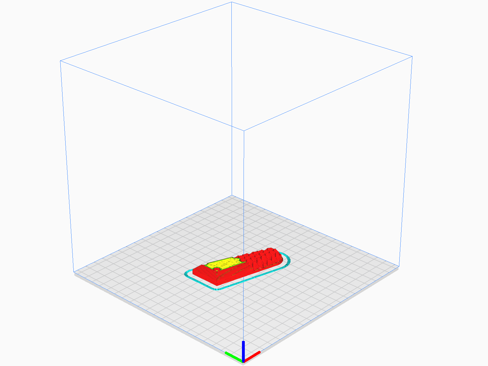
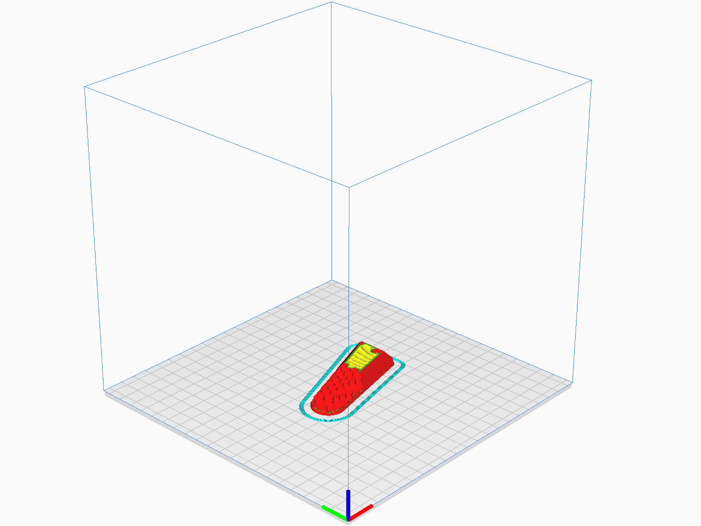

-   ### Files

    -   #### CAD  
        -   [RearBumper_Lower.ipt](https://github.com/citbrains/OpenPlatform/blob/a4b5907f3c764cb437537e5cbbeef6c4c5cdda09/mechanism/OpenPlatform_ver3_0/%E4%B8%8A%E5%8D%8A%E8%BA%AB/%E8%83%B4%E4%BD%93/RearBumper_Lower.ipt)

            `OpenPlatform/mechanism/OpenPlatform_ver3_0/上半身/胴体/RearBumper_Lower.ipt`

        -   [RearBumper_Lower_MIR.ipt](https://github.com/citbrains/OpenPlatform/blob/a4b5907f3c764cb437537e5cbbeef6c4c5cdda09/mechanism/OpenPlatform_ver3_0/%E4%B8%8A%E5%8D%8A%E8%BA%AB/%E8%83%B4%E4%BD%93/RearBumper_Lower_MIR.ipt)
            
            `OpenPlatform/mechanism/OpenPlatform_ver3_0/上半身/胴体/RearBumper_Lower_MIR.ipt`

    -   #### STL
        -   [RearBumper_Lower.stl](RearBumper_Lower/RearBumper_Lower.stl)
        -   [RearBumper_Lower_MIR.stl](RearBumper_Lower/RearBumper_Lower_MIR.stl)

    -   #### Gcode
        -   [Bumper_Lower.gcode](RearBumper_Lower/Bumper_Lower.gcode)
        -   [Bumper_Lower_MIR.gcode](RearBumper_Lower/Bumper_Lower/RearBumper_Lower_MIR.gcode)

    -   #### Profile
        -   [RearBumpere_Lower.curaprofile](RearBumper_Lower/RearBumpere_Lower.curaprofile)

-   ### Characteristical parameteres
    |Parameter Name|Parameter|
    |---|---|
    |**Infill Density [%]** インフィル密度|100|
    |**LayerHight [mm]** レイヤー高さ|0.2|
    |**Bulid Plate Temperature [℃]** ビルドプレート温度|60|
    |**Build Plate Adhesion Type** ビルドプレート接着タイプ|Skirt|

-   ### Quantity
    -   1 pc of each

-   ### Estimated print time
    -   2 h 51 m of each

-   ### Additional processing
    -   N/A

-   ### Works cited
    -   [issue](https://github.com/citbrains/citbrains_humanoid/issues/1197)

---
## SideBumper

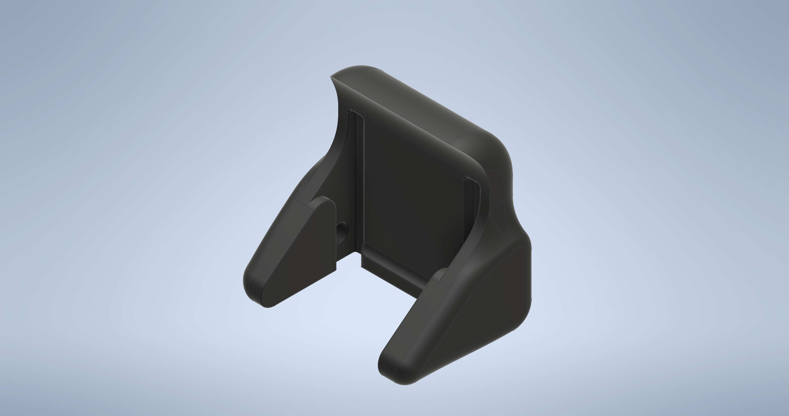

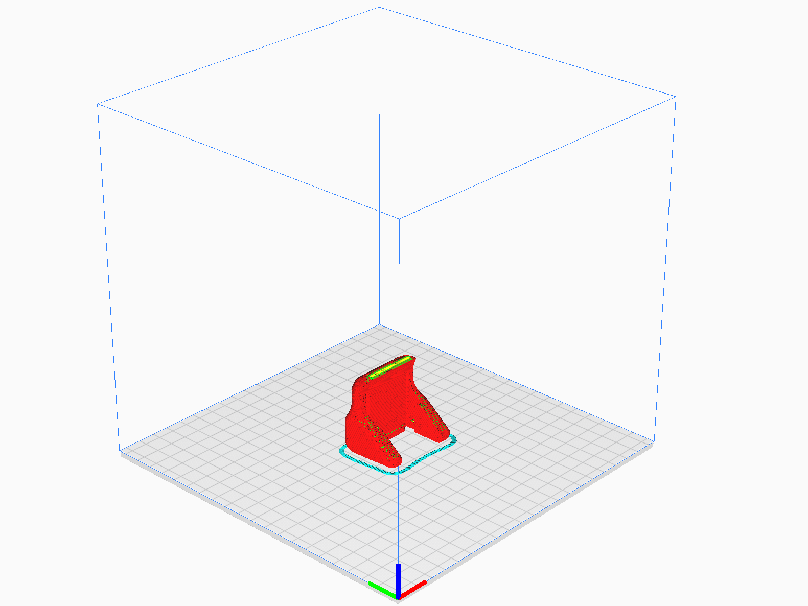

-   ### Files

    -   #### CAD  
        -   [SideBumper.ipt](https://github.com/citbrains/OpenPlatform/blob/a4b5907f3c764cb437537e5cbbeef6c4c5cdda09/mechanism/OpenPlatform_ver3_0/%E4%B8%8A%E5%8D%8A%E8%BA%AB/%E8%85%95/SideBumper.ipt)

            `OpenPlatform/mechanism/OpenPlatform_ver3_0/上半身/腕/SideBumper.ipt`

    -   #### STL
        -   [SideBumper.stl](SideBumper/SideBumper.stl)

    -   #### Gcode
        -   [SideBumper.gcode](SideBumper/SideBumper.gcode)

    -   #### Profile
        -   [SideBumper.curaprofile](SideBumper/SideBumper.curaprofile)

-   ### Characteristical parameteres
    |Parameter Name|Parameter|
    |---|---|
    |**Infill Density [%]** インフィル密度|15|
    |**LayerHight [mm]** レイヤー高さ|0.2|
    |**Bulid Plate Temperature [℃]** ビルドプレート温度|60|
    |**Build Plate Adhesion Type** ビルドプレート接着タイプ|Skirt|

-   ### Quantity
    -   2 pcs

-   ### Estimated print time
    -   1 h 57 m / 1 pc

-   ### Additional processing
    -   N/A

-   ### Works cited
    -   [issue](https://github.com/citbrains/citbrains_humanoid/issues/999#issuecomment-499572870)
