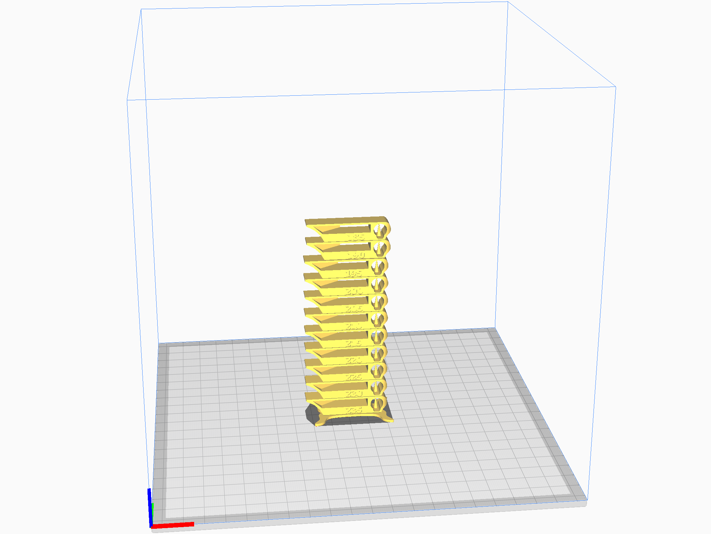

# Temp_Calibration_Tower

最適なノズル温度を見つけるために，ノズル温度を5℃ずつ変えたテストパターンを出力する．

---
## Table of contents
- [Temp calibration tower for TPU](https://github.com/MasatoKubotera/GankenKun_3DPrintParts/tree/master/Temp_Calibration_Tower#temp-calibration-tower-for-tpu)
- [How to change the temperature for each layer](https://github.com/MasatoKubotera/GankenKun_3DPrintParts/tree/master/Temp_Calibration_Tower#how-to-change-the-temperature-for-each-layer)
- [LICENSE](https://github.com/MasatoKubotera/GankenKun_3DPrintParts/tree/master/Temp_Calibration_Tower#license)

---
## Temp calibration tower for TPU

- ### Temp range
  185~235℃

- ### Files

  - #### STL
    - [SmartTemperatureTower_TPU_185-235.stl](TPU/SmartTemperatureTower_TPU_185-235.stl)

  - #### Gcode
    - [TowerTPU_185-235.gcode](TPU/TowerTPU_185-235.gcode)

  - #### Profile
    - [Temp_Tower_185-235.curaprofile](TPU/Temp_Tower_185-235.curaprofile)
---
## How to change the temperature for each layer
1.  拡張子→後処理→G-codeを修正を選択．

  

2. スクリプトを加える→ **ChangeAtZ 5.2.1(Experimental)** を選択．

  

3.  **Change Height** に変化させる高さを入力．**Change Extruder 1 Temp** に &#10004; して， **Extruder 1 Temp** に温度を入力する．
  - Height
    - Stand : 1.6 [mm]
    - each Temp Floor : 10 [mm]

  ※ 初期温度は通常の設定で行う．

---
## LICENSE
### [Creative Commons License CC-BY-SA](http://creativecommons.org/licenses/by-sa/3.0/deed.ja)

[SmartTemperatureTower_TPU_185-235](SmartTemperatureTower_TPU_185-235.stl) modified the original [Smart compact temperature calibration tower](http://www.thingiverse.com/thing:2729076).

Smart compact temperature calibration tower (http://www.thingiverse.com/thing:2729076) by gaaZolee is licensed under the Creative Commons - Attribution - Share Alike license.
