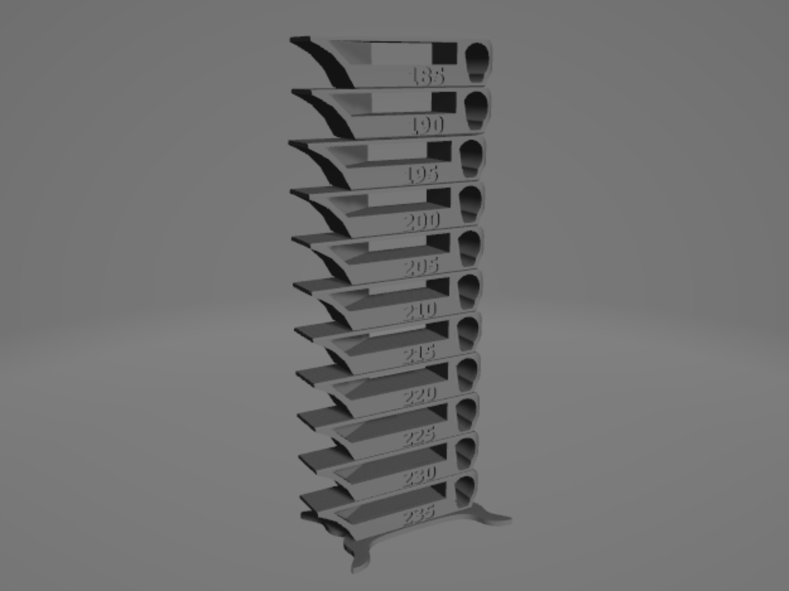

# Temp_Calibration_Tower
---
## Temp calibration tower for TPU

- ### Temp range
  185~235℃

- ### Files

  - #### STL
    - [SmartTemperatureTower_TPU_185-235.stl](SmartTemperatureTower_TPU_185-235.stl)

  - #### Gcode
    - 

  - #### Profile
    - 

---
## LICENSE
### [Creative Commons License CC-BY-SA](http://creativecommons.org/licenses/by-sa/3.0/deed.ja)

[SmartTemperatureTower_TPU_185-235](SmartTemperatureTower_TPU_185-235.stl) modified the original [Smart compact temperature calibration tower](http://www.thingiverse.com/thing:2729076).

Smart compact temperature calibration tower (http://www.thingiverse.com/thing:2729076) by gaaZolee is licensed under the Creative Commons - Attribution - Share Alike license.
